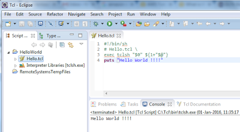

Eclipse is best IDE for development. We can use same Eclipse for development of TCL, but we will need to configure it . Dynamic Languages Toolkit (DLTK) [http://www.eclipse.org/dltk/](http://www.eclipse.org/dltk/) is set of frameworks which provides Tcl, Ruby, Javascript and Python development environments.

So to configure eclipse for TCL we need to download Dynamic Languages Toolkit. In this Toolkit we have other libraries too, but we will download only for TCL. After configuration we can run program directly from Eclipse .If you want to debug TCL Program we would need to configure debugger separately .

Let's start with configuration of Eclipse for TCL development .

1\. Downlaod TCL SDK and install . If you don't know how to install TCL on windows you can refer our last post: How to install and run TCL on this link [http://fervort.com/blog/2015/12/how-to-install-and-run-tcl/](http://fervort.com/blog/2015/12/how-to-install-and-run-tcl/)

2\. Download and Install Eclipse IDE for Java/JavaEE Developer . You can download from here https://eclipse.org/downloads/

3\. Start Eclipse and go to menu Help -> Install New Software . In Install window click on Add... button to add Repository details. You can give any name in Name field and add location link as [http://download.eclipse.org/technology/dltk/updates-dev/1.0/](http://download.eclipse.org/technology/dltk/updates-dev/1.0/)  . See Screenshot for details.

After clicking on Okay, It will show you all available packages. But for TCL we will select Dynamic Language Toolkit - TCL Developments Tools . See Screenshot for details.

4\. Click on Install and Accept License Agreement. Click on Finish and wait till Eclipse install all the required packages. After successful installation eclipse will ask to restart. Just restart the Eclipse.

5\. Next step is to setup TCL interpreter with Eclipse. For this go to Menu Windows -> Preferences . On left side select TCL tab. Expand it and select Interpreter. Click on add and browse to tclsh.exe located in bin directory of installation. See screenshot.

Till now we have configured eclipse for TCL. In next step we will create TCL project.

6\. To create project go to Menu File->Project-> TCL Project. (See screenshot). Give name to project and click on finish.

7\. To add new TCL file right click on newly created project New -> TCL File. Give name to TCL file with extension .tcl and click on finish.

8\. Add some TCl lines and right click on file -> Run As -> TCL Script .

You can see output in console window. See screenshot .

You can check our Video tutorial for installation and configuration of Eclipse for TCL on YouTube here [https://www.youtube.com/watch?v=ThL7qZN2msY](https://www.youtube.com/watch?v=ThL7qZN2msY)

<iframe src="https://www.youtube.com/embed/ThL7qZN2msY?feature=player_embedded" width="320" height="266" frameborder="0" allowfullscreen="allowfullscreen" data-thumbnail-src="https://i.ytimg.com/vi/ThL7qZN2msY/0.jpg"></iframe>

Try to configure Eclipse . Feel free to comment :)
