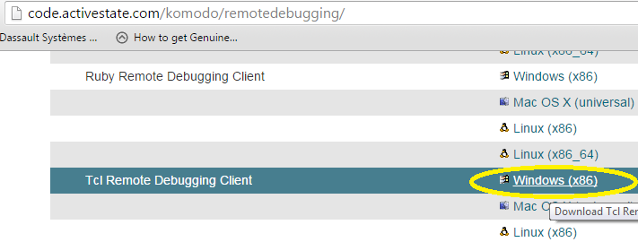
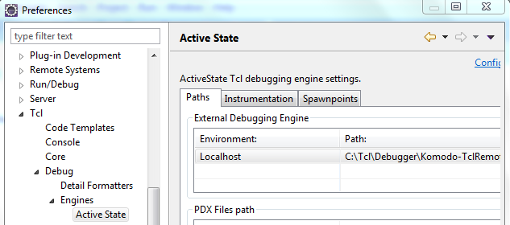
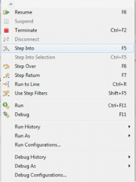

Eclipse is consider as good IDE for development as well as debugging . In last article we have seen how to configure eclipse to run TCL script [here is the link](http://fervort.com/blog/2016/01/how-to-configure-eclipse-as-tcl-ide/) . If you didn't configure eclipse for TCL then first do that because it is mandatory to configure eclipse for TCL debugging.

In this article we will see how to configure eclipse to debug TCL script . For this we would need to download Activestate's remote debugger from this link [http://code.activestate.com/komodo/remotedebugging/](http://code.activestate.com/komodo/remotedebugging/) **.** On this link you will see debugger for Pearl, PHP, Paython, Ruby and TCL. We would choose TCL remote debugger for Windows. Check Screenshot below : 

After downloading extract the zip package, and paste the package somewhere . Now open eclipse go to menu -> **Windows** -> **Preferences** . In preferences expand **TCL**\->**Debug** -> **Engines** -> **Active State** . Go to **Paths** Tab -> **External Debugging Engine** Section . Browse to path of **dbgp\_tcldebug.exe** which is located in package we just pasted . Check Screen below:

We have successfully configured debugger . Its time to debug the TCL script. Take sample script or you can take this simple script which checks whether number is even or odd .

```tcl
puts "Program to find even odd numbers"

set num 8

if { $num % 2 == 0 } {
 
 puts "number is even" 
 
} else {
 
 puts "number is odd " 

}
```
 

Save the script with some name and add breakpoint to script. Now go to **Run** and click on **debug** to start debugging. You can use different commands like **Step Into** , **Step Over** , **Step Return** , **Resume** , **Terminate**.

You can use **Step into** to go inside in procedure and **Step Over** is used if you don't want to debug the Procedure code. **Resume** and **Terminate** are used to resume program flow and Terminate current execution respectively.

For more details you can check our video tutorial on youtube.com

<iframe src="https://www.youtube.com/embed/U4cX751c2Qk?feature=player_embedded" width="320" height="266" frameborder="0" allowfullscreen="allowfullscreen" data-thumbnail-src="https://i.ytimg.com/vi/U4cX751c2Qk/0.jpg"></iframe>

Try to configure eclipse for debugging. You can add your comments !
