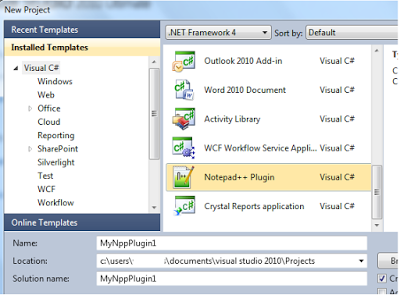
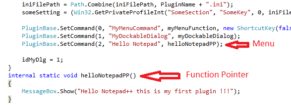
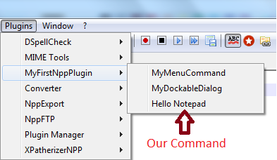

Notepad++ is best text/source code editor for Windows OS . Lots of good features have been added in Notepad++ . If you want any new feature you can create plugin and use it directly from Notepad++ .

It is possible to create Notepad++ plugin using VC++, C# .Net , Ada . In this tutorial we will see how to create Notepad++ plugin using C# .Net .

**1\. Download C# .Net Notepad++ Plugin :**

To develop plugin in C# .Net you can download Visual Studio C# .net template from this link : [https://notepad-plus-plus.org/contribute/plugin-howto.html](https://notepad-plus-plus.org/contribute/plugin-howto.html) or this direct link for download: [http://sourceforge.net/projects/sourcecookifier/files/other%20plugins/NppPlugin.NET.v0.5.zip/download](http://sourceforge.net/projects/sourcecookifier/files/other%20plugins/NppPlugin.NET.v0.5.zip/download)

**2\. Configure Plugin in Visual Studio :**

After downloading this package just extract it and copy **NppPlugin.zip** (unextracted) folder into

C:\\Users\\YOUR\_USER\_NAME\\Documents\\VisualStudio2010\\Templates\\ProjectTemplates\\Visual C#

Restart Visual Studio !

**3\. Create Plugin In Visual Studio:**

To create plugin open Visual Studio, Go to File -> New -> Project and select Notepad++ Plugin. See Screenshot :

Give name to project and click OK . You will see already added methods in Main.cs file . By default this template comes with 2 menus MyMenuCommand and MyDockableDialog in CommandMenuInit() method .We will add our own new menu . To add new menu go to method CommandMenuInit() and paste following line before idMyDlg = 1;

PluginBase.SetCommand(2, "Hello Notepad", helloNotepadPP);

We have defined new menu but for this menu we will need function pointer. Function pointer is name of method which will be invoked after executing our newly created command "Hello NotepadPP"

Copy and paste following function as function pointer in Main.cs file:

internal static void helloNotepadPP() {             MessageBox.Show("Hello Notepad++ this is my first plugin !!!"); }

Save Project. Finally code will look like this :

**4.Build Visual Studio Plugin Project:**

Go to Menu Build -> Build Solutions. Build will create .DLL file in binDebug or binRelease folder depend on your Solution configurations. Copy this .DLL file and paste into Notepad++ Plugin folder . For me it is found in this path : C:Program Files (x86)Notepad++plugins . Restart Notepad++ .

**5\. Run your First Plugin :**

After restart you will see New Plugin is added in Plugins menu . See screenshot:

This is just simple plugin for demonstration ! Check this tutorials video :

<iframe src="https://www.youtube.com/embed/t-WjQKSbBHw?feature=player_embedded" width="320" height="266" frameborder="0" allowfullscreen="allowfullscreen" data-thumbnail-src="https://i.ytimg.com/vi/t-WjQKSbBHw/0.jpg"></iframe>
